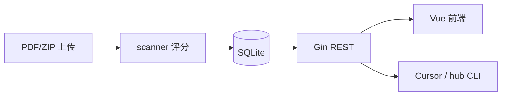

# 架构说明

```
agent-recruiting-hub/
├── backend/                 # Go API
│   ├── main.go
│   └── internal/
│       ├── server/          # Gin 路由、上传、导出
│       ├── store/           # SQLite + 批次/候选人
│       ├── scanner/         # 简历文本提取 + 启发式评分
│       ├── seed/            # 种子数据、面试题 QA、人工档位
│       └── export/          # Markdown 报告
├── frontend/                # Vue 3 + Element Plus + Ant Design Vue
│   └── src/
│       ├── views/           # 列表、上传、候选人详情
│       └── components/pipeline/  # 批次、看板、漏斗
├── data/                    # 运行时（gitignore）
│   ├── hub.db
│   └── resumes/
├── seed/                    # 初始 47 人 + PDF
├── docs/                    # 本站知识库 Markdown
└── scripts/
    ├── hub                  # CLI
    └── deploy-mirror.sh     # 远端部署
```

## 数据流



## 核心模型

**候选人 `candidates`**（页面信息基本都在这一张表）

| 字段 | 说明 |
|------|------|
| name, source, tier, status, batch_id | 姓名、来源、档位、进度、批次 |
| position_id, position_name | 招聘岗位（上传时选择；历史数据迁移为「实习生」） |
| skill_id | 检验标准（招聘 Skill）。由岗位绑定，当前仅 `intern` |
| eng_summary, project_summary, one_liner, action | 传统工程 / 深挖项目 / 摘要 / 建议 |
| score_total, eng_score, agent_score, reason, flags_json | 自动评分与标签（如 no_intern） |
| interview_order, tier_manual | S 档面试顺序、是否手动锁定档位 |
| interview_note | 面评（面试官手写，重评不覆盖） |
| resume_path | 相对路径 `data/resumes/姓名.pdf`（本地缓存，便于重评 OCR） |
| resume_key | OSS 对象键（如 `recruiting-hub/resumes/何鑫奎.pdf`） |

简历：**文件在 OSS**，库中只存 `resume_key` + 相对 `resume_path`。预览走 `/api/candidates/:id/resume`（OSS 签名 URL 或本地回退）。

**面试题 `interview_questions`**

| 字段 | 说明 |
|------|------|
| question, answer, level | 题目、面试官参考答案、L1/L2/L3 |

**批次 `batches`**

| 字段 | 说明 |
|------|------|
| name, tag, period_type | 批次名、唯一标签、日/周/月 |

**岗位 `positions`**

| 字段 | 说明 |
|------|------|
| name, slug | 岗位名（如「实习生」）、稳定标识 |
| skill_id | 该岗的检验标准（Skill） |
| jd | 岗位 JD（Markdown）；侧栏点岗位名打开 |
| is_open | 是否在招；侧栏岗位阶梯只列在招岗 |

不单独建「实习经历」表：实习有无用 `flags_json` 的 `no_intern` + 面试时人工确认。

## 评分逻辑（scanner）

- 优先 **wgModelHub**（`HUB_MODELHUB_ADDRESS`，模型默认 `gemini-3.1-pro-preview`）  
- 回退：关键词启发式  
- `/api/health` → `scanner: modelhub|heuristic`

## 前端标签页

- **候选人 / 列表**：筛人、打开详情（含岗位列）  
- **候选人 / 看板**：批次 + 漏斗  
- **岗位阶梯**：在招岗位；点岗位名看 JD；上传选岗后自动套用检验 Skill  
- **上传**：拖拽评估（先选招聘岗位）  
- **知识库**：本文档  
- 动态标签：候选人详情（简历 + 面试题）  

## 技术栈

| 层 | 技术 |
|----|------|
| API | Go, Gin, modernc.org/sqlite |
| 前端 | Vue 3, Vite, Element Plus, Ant Design Vue |
| 部署 | systemd + rsync |
