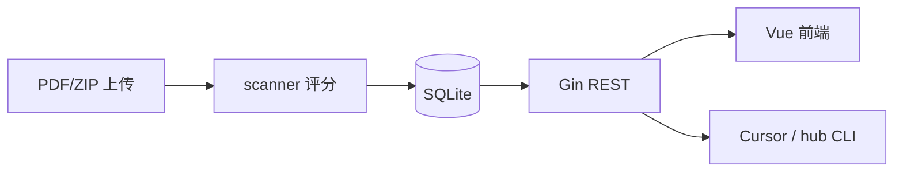

# 架构说明

```
agent-recruiting-hub/
├── backend/                 # Go API
│   ├── main.go
│   └── internal/
│       ├── server/          # Gin 路由、上传、导出
│       ├── store/           # SQLite + 批次/候选人
│       ├── scanner/         # 简历文本提取 + 启发式评分
│       ├── seed/            # 种子数据、面试题 QA、人工档位
│       └── export/          # Markdown 报告
├── frontend/                # Vue 3 + Element Plus + Ant Design Vue
│   └── src/
│       ├── views/           # 列表、上传、候选人详情
│       └── components/pipeline/  # 批次、看板、漏斗
├── data/                    # 运行时（gitignore）
│   ├── hub.db
│   └── resumes/
├── seed/                    # 初始 47 人 + PDF
├── docs/                    # 本站知识库 Markdown
└── scripts/
    ├── hub                  # CLI
    └── deploy-mirror.sh     # 远端部署
```

## 数据流



## 核心模型

**候选人 `candidates`**

- 档位 `tier`：S / A / B / C / 淘汰  
- 状态 `status`：screening → to_interview → interviewing → passed / completed / rejected  
- `tier_manual`：手动锁定档位，重评不覆盖  
- `batch_id`：所属招聘批次  

**批次 `batches`**

- `period_type`：daily / weekly / monthly / custom  
- 上传时按 `period_type` 自动归批，或指定 `batch_id`  

**面试题 `interview_questions`**

- `question` / `answer` / `level`（L1-L3）  
- 种子来自 `seed/qa.go`，经 `/api/sync/questions` 写入库  

## 评分逻辑（scanner）

- 实习 4 维 + 工程 4 维 + Agent 3 维 + 深度指标  
- 无实习关键词 → `no_intern` 降权  
- 图片 PDF → `thin` 标记，分数可能为负，需人工  

## 前端标签页

- **候选人**：批次选择 + 漏斗 + 列表/看板  
- **上传**：拖拽评估  
- **知识库**：本文档  
- 动态标签：候选人详情（简历 + 面试题）  

## 技术栈

| 层 | 技术 |
|----|------|
| API | Go, Gin, modernc.org/sqlite |
| 前端 | Vue 3, Vite, Element Plus, Ant Design Vue |
| 部署 | systemd + rsync |
